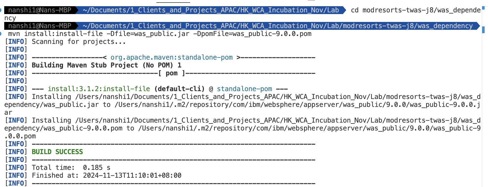
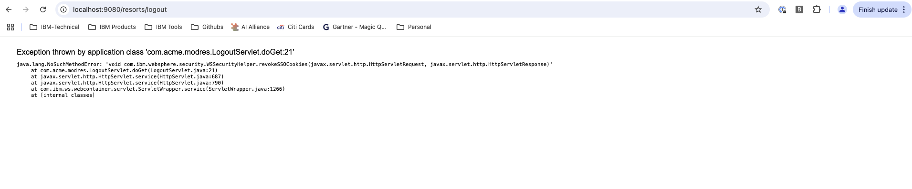
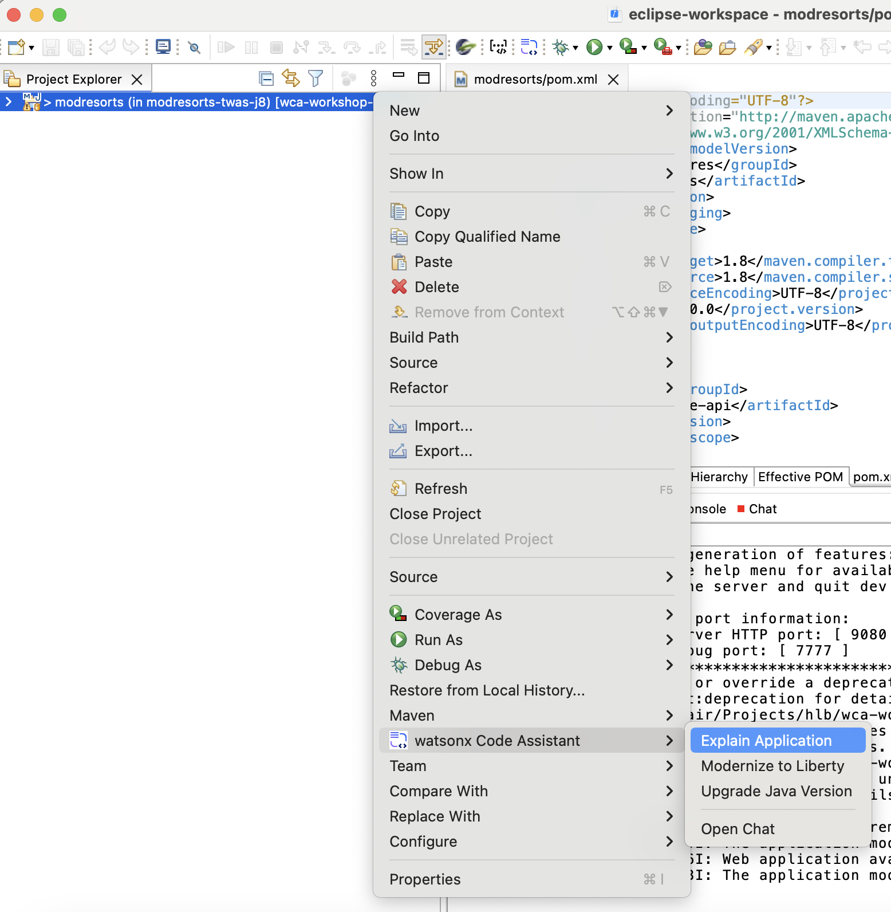
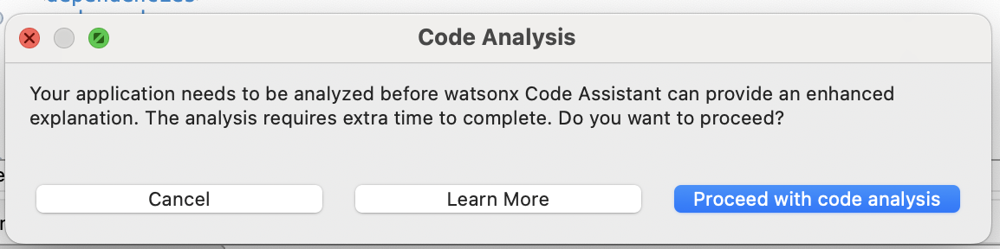
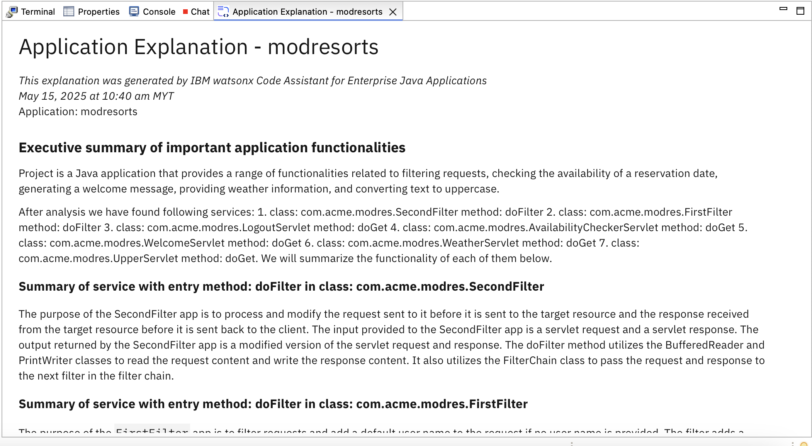

# Lab1: Code Explanation 

This document gives step-by-step guide to finish Lab1.

## Lab1 covers:

- Download recommended code assets.
- Explore the example `modresrots` application
- Explain `modresrots` application.


### 1. Code Asset Download

Git clone [GitHub repository](https://github.com/sidharthmittal25/wca4ej-workshop/tree/main) to your location of choice.


### 2. Build Application Project

- Open a terminal, and go to your project folder, and navigate to `was_dependency` folder.

```bash
cd <your-path>/wca4ej-workshop/modresorts-twas-j8/was_dependency
```
- Once inside the folder, run the following command to build project:

```bash
mvn install:install-file -Dfile=was_public.jar -DpomFile=was_public-9.0.0.pom
```



For Windows users, you might need to give full path for the build files `was_public.jar` and `was_public-9.0.0.pom`.


### 3. View Liberty App

To deploy the application on Liberty, you need to enable the Liberty Maven plug-in in your project. Add the Liberty Maven plug-in to the <plugins> section within the <build> block of your pom.xml file:

```
<plugin>
    <groupId>io.openliberty.tools</groupId>
    <artifactId>liberty-maven-plugin</artifactId>
    <version>3.11.2</version>
</plugin>
```

Open a terminal, ensure it is located at the your sample-app-mod-v1 project directory, and start the application in Liberty dev mode:

```
mvn liberty:dev
```

Once the server starts, visit http://localhost:9080/resorts in your browser. You should see the application’s homepage.


Once the app started, you can get the url (in my case `http://localhost:9080/resorts/`) and open in your browser to checkout the web app.

**[IMPORTANT]** Because we are running this application using Liberty in Java21, while this application is built for WebSphere in Java8, even though the application started successfully, **there are 2 places that have error because of this migration + upgrade**.


The first one, if you click the `Where to?` dropdown and select any location, you will find the location information module showing errors.


The Second one, the `Logout` buttom does not work if you click on it.



We will **fix these errors** in the later labs.


### 4. Explain Project Code

To understand the whole project, right click on the `modresorts-twas-j8` folder and select `watsonx Code Assistant` - `Explain Application`.



VSCode will prompt you that the process takes extra time. Click `Proceed with code analysis`.



The analysis might take 1-2 minutes to finish and a prompt will show up in the bottom right cornor.

Now we can open the report and read through the details.

