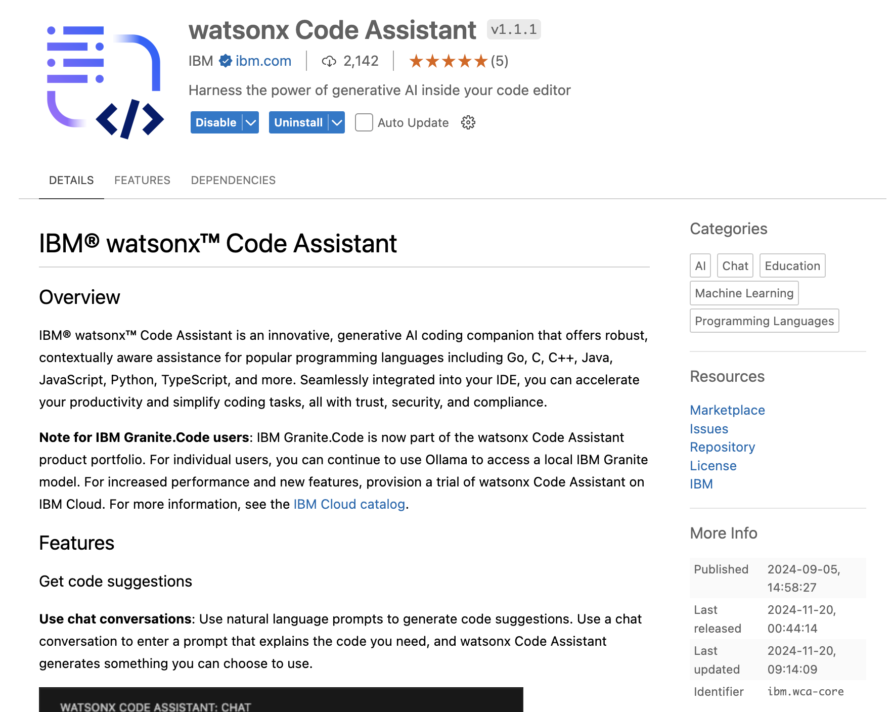
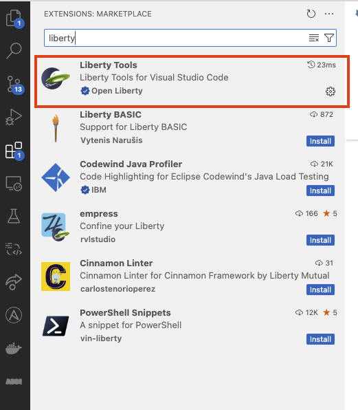

# Installation guide for WCA on VSCode

This document gives infomration on installing software tools with IDE VSCode that are needed to run **Watson Code Assistant**


## Environment setup 

### 1. Java installation

#### Install Java21 using this link:
- [Download Java for MacOS - Arm64](https://download.oracle.com/java/21/latest/jdk-21_macos-aarch64_bin.tar.gz)
- [Download Java for MacOS - x86](https://download.oracle.com/java/21/latest/jdk-21_macos-x64_bin.tar.gz)
- [Download Java for Windows](https://download.oracle.com/java/21/latest/jdk-21_windows-x64_bin.zip)

All the above are compressed files, you can extract them to any folder in your local.

- Check if Java is installed properly:
```bash
java --version
```

- After installing java, add java to `PATH` variable and set `JAVA_HOME` envitonment variable
- **For Mac**:
  - Open .zshrc or .bash_profile
      ```bash
      nano ~/.zshrc
      ```
  - Add the following lines
      ```bash
      export JAVA_HOME=/Library/Java/JavaVirtualMachines/<java version>/Contents/Home
      ```
      ```bash
      export PATH=$JAVA_HOME/bin:$PATH
      ```
  - Save the file and exit (press CTRL + X, then Y, and hit Enter)
  - Reload the shell configuration so the changes take effect.
      ```bash
      source ~/.zshrc
      ```
  - Verify the JAVA_HOME with the following command:
      ```bash
      echo $JAVA_HOME
      ```
- **For Windows**:
  - Open Environment variables using windows search bar (search for edit environment variables in the search bar)
  
  

  - Set JAVA_HOME variable using Environment variables (click on new if you do not have a JAVA_HOME set or click on edit to change the existing JAVA_HOME, and point it to the Java you installed in the earlier steps:
    
  

    ```bash
    JAVA_HOME= C:\Program Files\Java\jdk-21
    ```
    
  - Add Java to PATH using Environment variables:
 
  
 
    ```bash
    %JAVA_HOME%\bin
    ```


### 2. Install Maven

- **For Windows**
    - Visit the official Maven website: [Maven Download Page](https://maven.apache.org/download.cgi)
    - Under "Files", click on the binary zip archive link (e.g., apache-maven-x.x.x-bin.zip). 
    - Extract the zip file to a location of your choice, e.g., C:\Apache\maven.
    - Set MAVEN_HOME variable using Environment variables:
      ```bash
      MAVEN_HOME= <path-to-folder>\maven\apache-maven-3.9.9-bin\apache-maven-3.9.9
      ```
    - Add Maven to PATH using Environment variables: 
      ```bash
      <path-to-folder>\maven\apache-maven-3.9.9-bin\apache-maven-3.9.9\bin
      ```
- **For Mac**
   - Install maven using homebrew
      ```bash
      brew install maven
      ```
   - Check if maven is installed properly:
      ```bash
      mvn --version
      ```


### 3. Install VSCode

- [VSCode Official Website](https://code.visualstudio.com/download) for installation


### 4. WCA API Key ()

You will be given API key by the IBM. If you have any issue accessing the API key, please raise it to the instructor.


### 5. Download WCA extension

Download watsonx Code Assistant and watsonx code assistant for enterprise Java extensions from Marketplace


Install both the above extensions.

For more details you can see the product page of respective extensions.




### 6. Login into WCA


#### After installing the extension from **Step 5**, 

- Login with WCA API Key at the bottom left corner of VSCode. After successfully signed in, the number indicator should be gone.


### 7. Installing Liberty Tools and Java Extension

Install the Liberty Tools and extension Pack for Java extensions from VSCode marketplace as shown below.




### 8. Start Using WCA

You can check by navigating to the **watsonx Code Assistant** tab if your API Key is setup correctly by opening the chat window of WCA and chat with the model.

