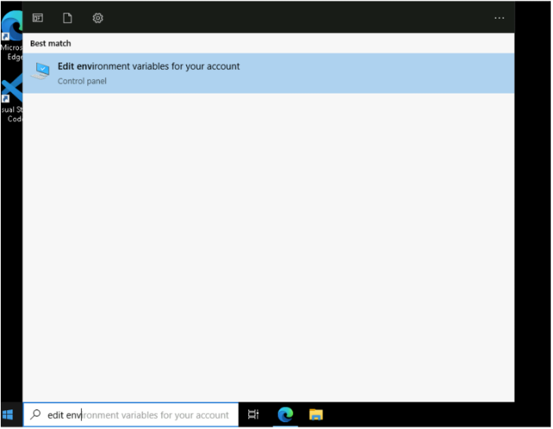
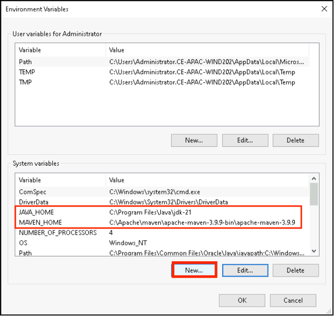
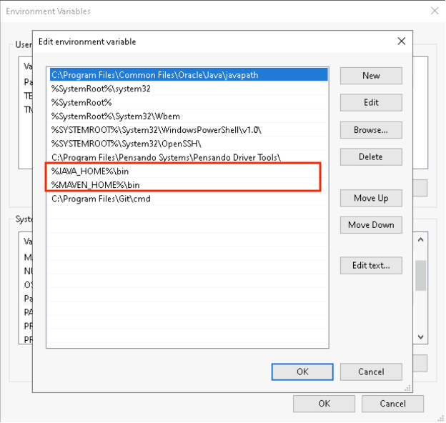
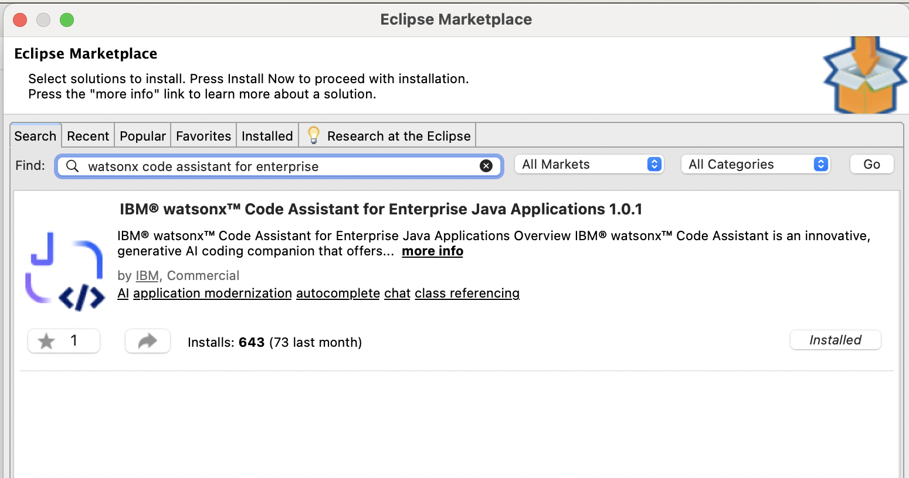
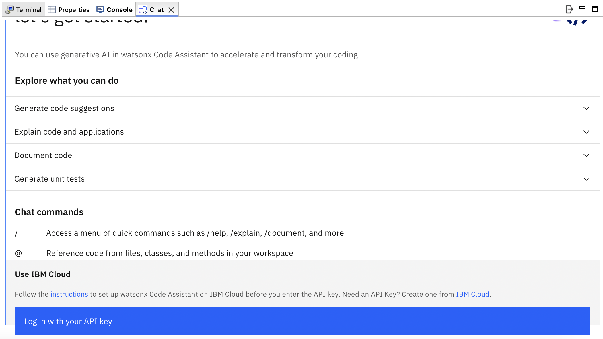
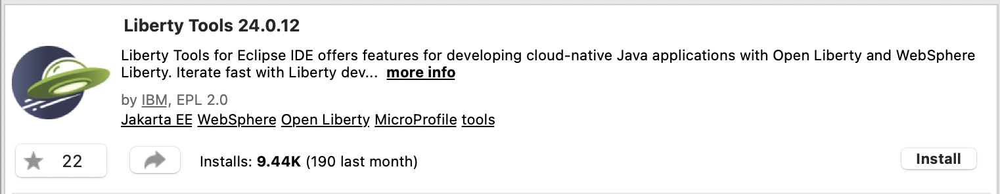

# Installation guide for WCA on Eclipse

This document gives information on installing software tools with Eclipse IDE that are needed to run **watsonx Code Assistant**

## Environment setup 

### 1. Set up your network

To ensure that your developers can connect the IDE extension or plug-in, you need to allow access to IBM Cloud URLs. Make sure your organization's network allows access to:
- https://iam.cloud.ibm.com/
- https://api.dataplatform.cloud.ibm.com/

### 2. Java installation

#### Install Java21 using this link:
- [Download Java for MacOS - Arm64](https://download.oracle.com/java/21/latest/jdk-21_macos-aarch64_bin.tar.gz)
- [Download Java for MacOS - x86](https://download.oracle.com/java/21/latest/jdk-21_macos-x64_bin.tar.gz)
- [Download Java for Windows](https://download.oracle.com/java/21/latest/jdk-21_windows-x64_bin.zip)

All the above are compressed files, you can extract them to any folder in your local.

- Check if Java is installed properly:
  ```bash
  java --version
  ```
- After installing java, add java to `PATH` variable and set `JAVA_HOME` environment variable
- **For Mac**:
  - Open .zshrc or .bash_profile
      ```bash
      nano ~/.zshrc
      ```
  - Add the following lines
      ```bash
      export JAVA_HOME=/Library/Java/JavaVirtualMachines/<java version>/Contents/Home
      ```
      ```bash
      export PATH=$JAVA_HOME/bin:$PATH
      ```
  - Save the file and exit (press CTRL + X, then Y, and hit Enter)
  - Reload the shell configuration so the changes take effect.
      ```bash
      source ~/.zshrc
      ```
  - Verify the JAVA_HOME with the following command:
      ```bash
      echo $JAVA_HOME
      ```
- **For Windows**:
  - Open Environment variables using windows search bar (search for edit environment variables in the search bar)
  
    

  - Set JAVA_HOME variable using Environment variables (click on new if you do not have a JAVA_HOME set or click on edit to change the existing JAVA_HOME, and point it to the Java you installed in the earlier steps:
    
  

    ```bash
    JAVA_HOME= C:\Program Files\Java\jdk-21
    ```
    
  - Add Java to PATH using Environment variables:
 
  
 
    ```bash
    %JAVA_HOME%\bin
    ```

### 3. Install Maven

- **For Windows**
    - Visit the official Maven website: [Maven Download Page](https://maven.apache.org/download.cgi)
    - Under "Files", click on the binary zip archive link (e.g., apache-maven-x.x.x-bin.zip). 
    - Extract the zip file to a location of your choice, e.g., C:\Apache\maven.
    - Set MAVEN_HOME variable using Environment variables:
      ```bash
      MAVEN_HOME= <path-to-folder>\maven\apache-maven-3.9.9-bin\apache-maven-3.9.9
      ```
    - Add Maven to PATH using Environment variables: 
      ```bash
      <path-to-folder>\maven\apache-maven-3.9.9-bin\apache-maven-3.9.9\bin
      ```
- **For Mac**
   - Install maven using homebrew
      ```bash
      brew install maven
      ```
   - Check if maven is installed properly:
      ```bash
      mvn --version
      ```

### 4. Install Eclipse

- [Eclipse Official Website](https://www.eclipse.org/downloads/) for installation
- The plug-in is compatible with:
    - **Eclipse IDE for Java Developers** or **Eclipse IDE for Enterprise Java and Web Developers**
    - Versions **2024-06**, **2024-09**, and **2024-12**
- On Windows, the plug-in requires the Microsoft Edge WebView2 runtime. In newer versions of Windows this might already be installed.
- Operating systems:
    - MacOS
    - Windows 11
    - Fedora Linux 41
    - Red Hat Enterprise Linux 8
    - Ubuntu 20.04

### 5. Update HTTP proxy settings

If your organization uses an HTTP proxy server, you need to update your Eclipse IDE settings so it can connect correctly. You might receive console errors when you try to connect and this setting is missing.

1. Open the Eclipse IDE settings.
2. In the General section, click Network Connections.
3. Set Active Provider to Manual.
4. Select the schema, such as HTTPS, then click Edit.
5. Enter the host URL and port of your HTTP proxy server.
6. If you need to include authentication information, click Requires Authentication, then enter your username and password.
7. Click OK to apply the changes.


### 6. WCA API Key

You will be given API key by the workshop instructors via email. If you have any issue accessing the API key, please raise it to the instructor.

### 7. Install WCA Plugin

To install the plug-in from the Eclipse Marketplace:
1. In your Eclipse IDE, click the Help menu, then choose Eclipse Marketplace.
2. To install the plug-in for Standard plans, search for watsonx Code Assistant for Enterprise Java Applications.
3. Click the Install button for the plug-in you need.
4. On Confirm Features, review the items, then click Confirm.
5. On Review Licenses, read the license, click to agree, then click Finish.
6. On Trust Authorities, click the checkbox, then click Trust Selected.
7. On Trust Artifacts, click the Type checkbox, then click Trust Selected.
8. You need to restart Eclipse. On Software Updates, click Restart Now.



### 8. Log into WCA

#### After installing the plugin from **Step 5**, 

- After Eclipse restarts, click Window, select Show View, then click Other.
- In the Show View dialog, open the watsonx Code Assistant folder, select Chat, then click Open.
- Click Log in with your API key.
- In the Security Preferences, enter your IBM watsonx Code Assistant API key.
- If your account is associated with more than one IBM Cloud data center, also select the preferred region from the drop-down list.
- Click Apply and close to exit the Security Preferences.



### 9. Test that the watsonx Code Assistant plugin is working

- Type a programming question in the chat.

### 10. Installing Liberty Tools and Java Extension

Install Liberty Tools from Eclipse marketplace as shown below.


